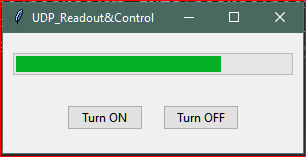

RPI_PICOW_UDPsendRecive  
Small demo script for pc and picow communicatio via udp over wifi  
PC side is coded in python with simple GUI.  
GUI allows simple LED ON/OFF controll.  
  
PICOW side is programed in Arduino IDE.  
